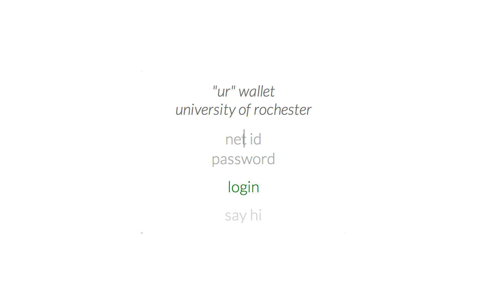
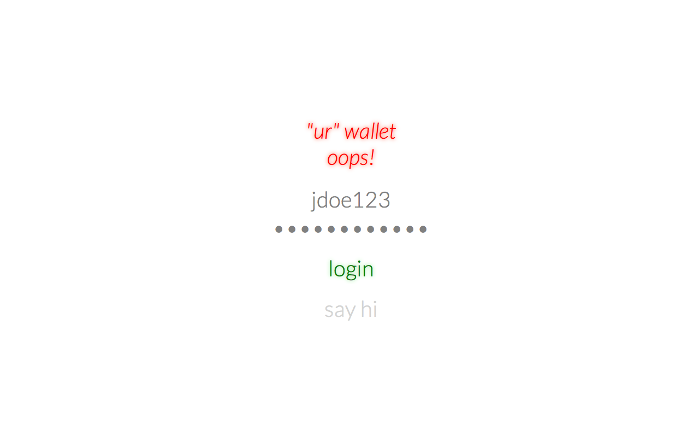
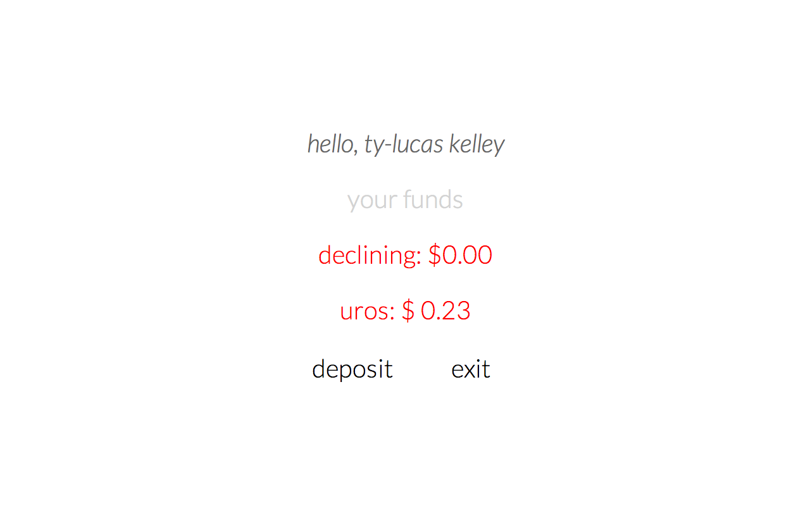

#UR Wallet
_2014 Ty-Lucas Kelley and Casey Waldren_

_Get it on the [Chrome Web Store](https://chrome.google.com/webstore/detail/ur-wallet/mimeggmmcphbjpangefbghnfhbaaacnm)!_

_Version: 2.2.1, Last Updated: 6/15/2014_

**NOTE**: This project is no longer maintained.

####Description

This extension is desgined to provide University of Rochester students with easy access to their Declining and URos balances. Get it from the Chrome Webstore today!

####Screenshots

Login Screen

Error Page

Main View

**LICENSE**

	This program is free software: you can redistribute it and/or modify
	it under the terms of the GNU General Public License as published by
	the Free Software Foundation, either version 3 of the License, or
	(at your option) any later version.

	This program is distributed in the hope that it will be useful,
	but WITHOUT ANY WARRANTY; without even the implied warranty of
	MERCHANTABILITY or FITNESS FOR A PARTICULAR PURPOSE.  See the
	GNU General Public License for more details.

	You should have received a copy of the GNU General Public License
	along with this program.  If not, see <http://www.gnu.org/licenses/>.
